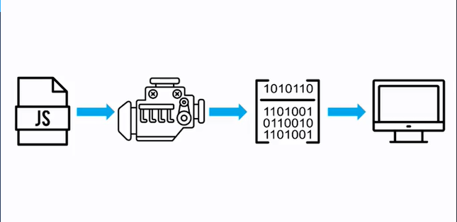
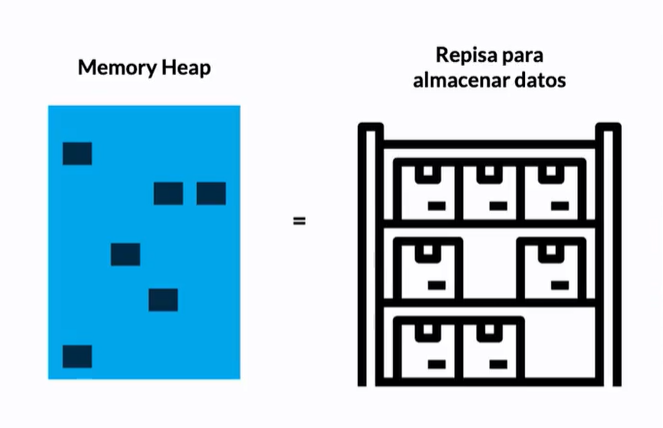

# **JavaScrit Engine y el Navegador**
### **JavaScrit Engine**
Motor de JS,interpreta el codigo para convertilo a Maching Code.

```Just in time compiler:``` Es la compilación en tiempo real que sucede en el proceso del Engine.


**V8**
Es el motor de JS que corre en Chrome,es open source lo cual hace que otros navegadores lo implementen.

Una vez que el navegador recibe nuestro codigo y genera un entorno global(Global Environment)
Genera:
- Global Object: Window
- this: variable global=Window  (hace referencia a window)
- Outer Evironment


El objeto window al inicio te provee de varias API listas para ser 
utilizadas.


**Proceso de ejecucion**


- Archivo JS: Al momento que entra en el navegador se genera el objeto global.
- Parser: Se busca los Keywords
- Sintax tree: Generado,para que el iterprete lo lea linea por linea.
- Profiler: Si hay cierto codigo no tan claro(variables sin inicializar,funciones llamadas antes de declarar)
hace los cambios pertinentes(optimizando)

**Memory Heap**

Es como una repisa donde se guardan los valores de nuestras variables
y funciones. se conecta de forma directa con el call Stack




**Call Stack(Pila de ejecucion)**
Las tareas se apilan de abajo hacia arriba
El ultimo en entrar es el primero en salir.
🙌Tiene un limite maximo para las apilaciones🙌
