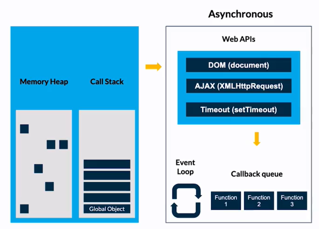

# **JavaScrit Engine y el Navegador**

### **JavaScrit Engine**
Motor de JS,interpreta el codigo para convertilo a Maching Code.

```Just in time compiler:``` Es la compilación en tiempo real que sucede en el proceso del Engine.


**V8**
Es el motor de JS que corre en Chrome,es open source lo cual hace que otros navegadores lo implementen.

Una vez que el navegador recibe nuestro codigo y genera un entorno global(Global Environment)
Genera:
- Global Object: Window
- this: variable global=Window  (hace referencia a window)
- Outer Evironment


El objeto window al inicio te provee de varias API listas para ser 
utilizadas.


**Proceso de ejecucion**


- Archivo JS: Al momento que entra en el navegador se genera el objeto global.
- Parser: Se busca los Keywords
- Sintax tree: Generado,para que el iterprete lo lea linea por linea.
- Profiler: Si hay cierto codigo no tan claro(variables sin inicializar,funciones llamadas antes de declarar)
hace los cambios pertinentes(optimizando)

👉[Hoisting MDM](https://developer.mozilla.org/en-US/docs/Glossary/Hoisting)

**Memory Heap**

Es como una repisa donde se guardan los valores de nuestras variables
y funciones. se conecta de forma directa con el call Stack

[Memori Heap](./app/img/memory-Heap.png)


**Call Stack(Pila de ejecucion)**
Las tareas se apilan de abajo hacia arriba
El ultimo en entrar es el primero en salir.
🙌Tiene un limite maximo para las apilaciones🙌


[video: cocina del codigo](https://www.youtube.com/watch?v=ygA5U7Wgsg8)

[Video:Diego de granda](https://platzi.com/clases/1798-javascript-navegador/25685-call-stack/)

**Garbage Collector**
 limpia la memoria de los datos no utilizados para no sobrecargarla y seguir trabajando sin problemas.
 
 El algoritmo `Mark and Sweep`  limpia las variables que fueron renombradas 
**Stack Overflow**
Es el desborde de la pila de tareas 


**Asincronia**

JS: es sincrono ,sin ebargo puede asignar ciertas tareas que ejecute el navegador.



```

console.log('taco 1');
console.log('taco 2');
console.log('taco 3');
setTimeout(()=>{
    console.log('Torta')
},500);  // tarea asignada al navegador
console.log('taco 4');

//reuslt
taco 1
taco 2
taco 3
taco 4
Torta


//2 setTimeout en --->0
console.log('taco 1');
console.log('taco 2');
console.log('taco 3');
setTimeout(()=>{
    console.log('Torta')
},0);  // tarea asignada al navegador
console.log('taco 4');

//result
taco 1
taco 2
taco 3
taco 4
Torta

```
**JavaScript Run Time**

Conceptos

**Memory Heap:** Espacio en donde se guardan las funciones y las variables

**Call Stack:** Espacio en donde se estarán apilando todas las tareas de las cosas que debemos hacer en JS para darle interacción al navegador

**Web API:** APIs propias del navegador

- ayuden a manipular el dom
- ayuda a manipular el tiempo de respuesta de algunas funciones
Que no ayudan a generar peticiones
Funciones que el navegador ofrece: https://developer.mozilla.org/en-US/docs/Web/API

**Callback Queue:** Bandeja de espera (espera a que el Call Stack este vacío).

**Event Loop:** Observador

**Funcionamiento**

JavaScript delega las tareas pertenecientes del navegador al navegar para continuar ejecutando las funciones que le son propias. En paralelo el navegador comienza a trabajar con esa función y al terminar la colocara en el Callback Queue.

Luego el Event Loop lo que hace es preguntar al Call Stack si termino con sus tareas y esta vació. En caso de que el Call Stack este ocupado con una tarea le dice “no”. En caso de haber terminado con sus tareas, el Event Loop mueve el Fn1 del Callback Queue al Call Stack.
